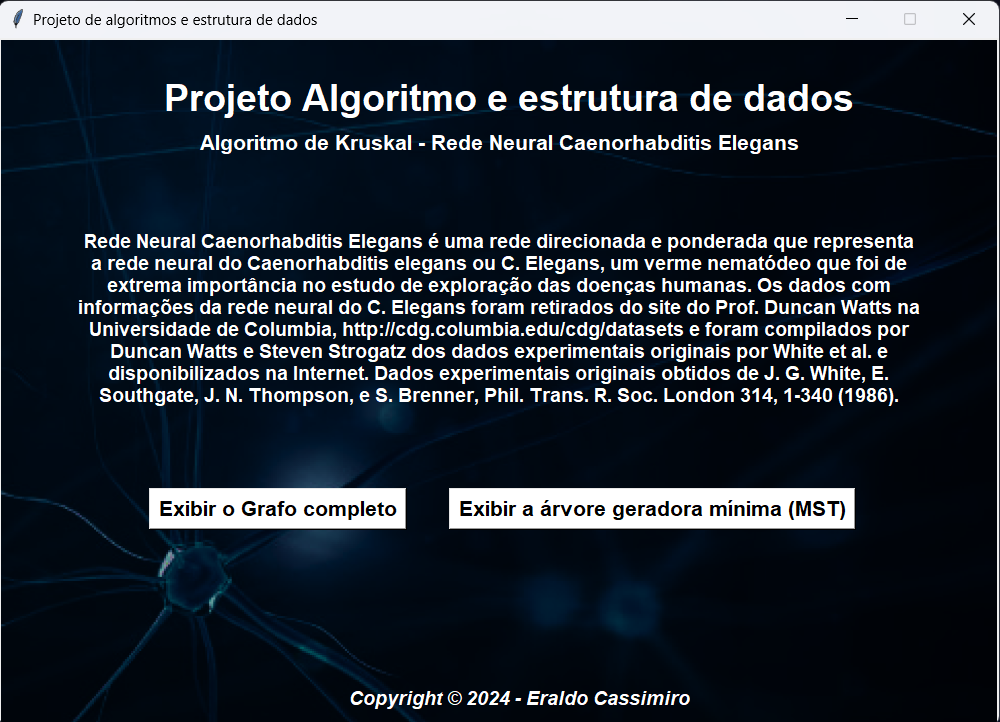
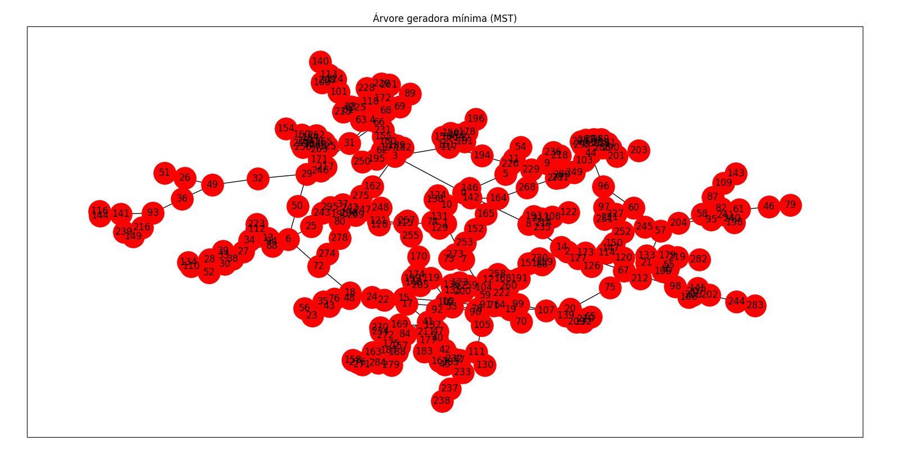
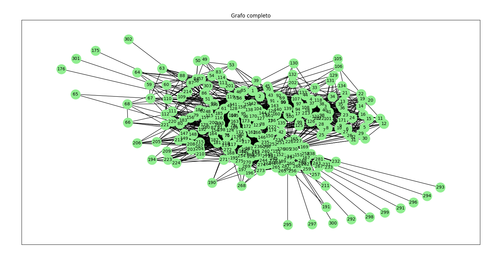

# <p align="center"> Projeto Kruskal - Algorimos e estrutura de dados </p>

<p align="center">
  
</p>

<br/>

## 📝 Contexto do problema

A base de dados utilizada consiste em uma rede neural direcionada e ponderada que representa o sistema nervoso do Caenorhabditis elegans, também conhecido como C. Elegans, um verme nematódeo que desempenhou um papel crucial no estudo das doenças humanas. Os dados referentes à rede neural do C. Elegans foram obtidos do site do Prof. Duncan Watts da Universidade de Columbia, disponível em http://cdg.columbia.edu/cdg/datasets, e foram compilados por Duncan Watts e Steven Strogatz a partir dos dados experimentais originais de White et al. Esses dados foram posteriormente disponibilizados online. Os dados experimentais originais foram adquiridos de J. G. White, E. Southgate, J. N. Thompson e S. Brenner, conforme detalhado em Phil. Trans. R. Soc. London 314, 1-340 (1986).

Link para a base de dados: Rede neural de C. Elegans - http://www-personal.umich.edu/~mejn/netdata/

A base de dados compreende um grafo com nós e arestas, cada um associado a atributos específicos. Os nós são identificados por IDs e rótulos (labels), sendo o formato padrão: Nó 1: ID 1, Rótulo "51". Já as arestas conectam esses nós, apresentando valores específicos. O formato típico das arestas é: Aresta do Nó 137 para o Nó 89, com um valor de 3.

<br/>

## 👨🏿‍💻 Implementação

### Algoritmo utilizado: ``` Kruskal ```

### Desenvolvimento: 

Comecei por selecionar uma base de dados que atendesse aos requisitos específicos do nosso objetivo. Em seguida, criei o projeto no GitHub para facilitar a atualização contínua a cada implementação de nova funcionalidade.

Em seguida, desenvolvi o algoritmo de Kruskei utilizando dados mockados. Em seguida, Desenvolvemos um código que permitisse o acesso e tratamento dos dados do arquivo, processando-os linha por linha. Com o algoritmo de Kruskel e com os dados tratados em mãos, fiz a integração dos dois, resultando na árvore geradora mínima da base de dados escolhida.

O próximo passo foi o desenvolvimento de uma interface gráfica amigável para o programa, e a plotagem dos grafos.

<br/>

### 📚 Bibliotecas utilizadas:
- [Matplotlib](https://matplotlib.org/): Utilizei a biblioteca Matplotlib para exibir o grafo principal e o MST.
- [Networkx](https://networkx.org/documentation/stable/reference/generated/networkx.drawing.nx_pylab.draw_networkx.html): Utilizei a biblioteca Networkx para criar o grafo principal e do grafo MST. Utilizei algumas de suas ferramentas para melhorar a visualização dos grafos e deixar elas mais simples e intuitivas para os usuários.
- [Tkinter](https://docs.python.org/3/library/tkinter.html): Utilizei a biblioteca Tkinter para a criação da nossa interface gráfica de usuário, com ela criei a janela de consulta de dados, os botões exibidos na janela, adicionei uma imagem no background da janela e também a algumas caixas de texto impressas na janela.

<br/>

## 💻 Projeto

###  Para rodar o projeto localmente em seu computador, siga as instruções abaixo:
```bash
# Clone o projeto
# Abra o seu terminal e execute o comando abaixo
$ git clone https://github.com/NetoCassimiro/projeto-algoritmos-kruskal.git

# Rode o projeto
$ execute o arquivo main.py em seu editor favorito

# Instale todas as bibliotecas necessárias
$ Verifique a mensagem de erro em seu terminal para identificar todas as bibliotecas necessárias

# Rode o projeto
$ execute novamente o arquivo main.py

```

### Imagens:

- Tela inicial do sistema
  
<p align="center">
  
</p>

- Plotagem da árvore geradora mínima
  
<p align="center">
  
</p>


- Plotagem do grafo completo
  
<p align="center">
  
</p>

<br/>

## 🔎 Referências

### Base de dados:
Alex arenas datasets. Disponível em: <https://deim.urv.cat/~alexandre.arenas/data/welcome.htm>. Acesso em: 20  ago.  2023.
Disponível em: <http://cdg.columbia.edu/cdg/datasets>. Acesso em: 20  ago.  2023.

<br/>
